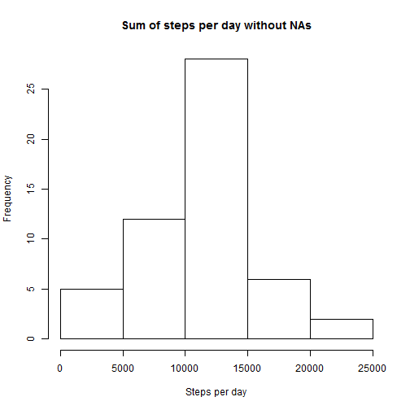
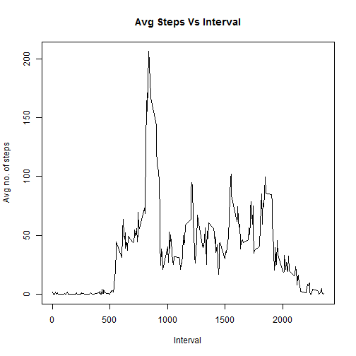
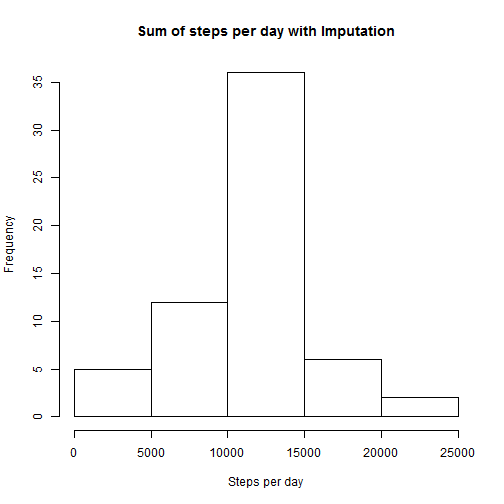
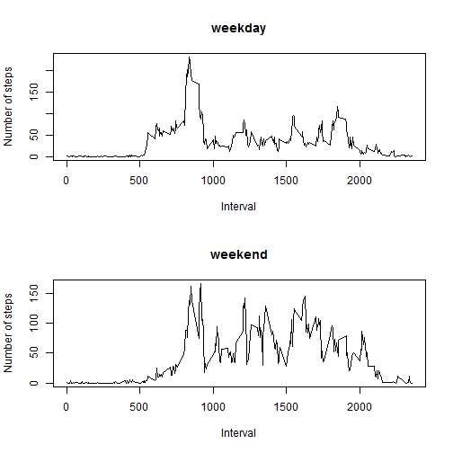

# Reproducible Research: Peer Assessment 1

This assignment makes use of data from a personal activity monitoring device. This device collects data at 5 minute intervals through out the day. The data consists of two months of data from an anonymous individual collected during the months of October and November, 2012 and include the number of steps taken in 5 minute intervals each day.

## Loading and preprocessing the data

Here we load the data and make any changes necessary for analysis.


```r
activity <- read.csv("activity.csv")
```


```r
activity_NAomit <- na.omit(activity)
sum_stepsperday <- aggregate(activity_NAomit$steps,list(activity_NAomit$date),sum)
sum_stepsperday$Group.1 <- (as.Date(sum_stepsperday$Group.1))
```
## What is mean total number of steps taken per day?

Here, we ignore the missing values in the dataset and plot the histogram and calculate the mean and median of the total number of steps taken per day.


```r
hist(as.numeric(sum_stepsperday$x),xlab = "Steps per day", main = "Sum of steps per day without NAs")
```

 


```r
mean_stepsperday <- mean(sum_stepsperday$x)
median_stepsperday <- median(sum_stepsperday$x)
```
Mean total number of steps taken per day: **1.0766 &times; 10<sup>4</sup>**

Median total number of steps taken per day: **10765**

## What is the average daily activity pattern?

Now, we create a time-series plot of the 5-min interval(x-axis) and the average number of steps taken, averaged across all days(y-axis)


```r
avgsteps_interval <- aggregate(activity_NAomit$steps, list(activity_NAomit$interval),mean)
plot(avgsteps_interval$Group.1,avgsteps_interval$x, xlab = "Interval",ylab = "Avg no. of steps", main = "Avg Steps Vs Interval", type = "l")
```

 


```r
avgsteps_max <- max(avgsteps_interval$x)
int_max <- avgsteps_interval$Group.1[match(avgsteps_max,avgsteps_interval$x)]
```
Which 5-minute interval, on average across all the days in the dataset, contains the maximum number of steps? 
**835**

## Imputing missing values

1.Calculate and report the total number of missing values in the dataset (i.e. the total number of rows with NAs)


```r
NAtotal <- sum(is.na(activity))
```

Total no. of missing values in the dataset: **2304**

2.Fill in all the missing values with the mean for that day. 


```r
library(Hmisc)
```

```
## Loading required package: grid
## Loading required package: lattice
## Loading required package: survival
## Loading required package: splines
## Loading required package: Formula
## 
## Attaching package: 'Hmisc'
## 
## The following objects are masked from 'package:base':
## 
##     format.pval, round.POSIXt, trunc.POSIXt, units
```

```r
activity$nanewval <- rep(avgsteps_interval$x, 61)
subset <- subset(activity, is.na(steps)== TRUE)
subset$steps <- impute(subset$steps,subset$nanewval)
activity$steps <- impute(activity$steps, subset$steps)
```

3.Create a new dataset that is equal to the original dataset but with the missing data filled in.


```r
activity_imputed <- activity[1:3]
```

4.Make a histogram of the total number of steps taken each day

```r
sum_stepsperdayi <- aggregate(activity_imputed$steps,list(activity_imputed$date),sum)
sum_stepsperdayi$Group.1 <- (as.Date(sum_stepsperdayi$Group.1))
```


```r
hist(as.numeric(sum_stepsperdayi$x),xlab = "Steps per day", main = "Sum of steps per day with Imputation")
```

 

Calculate and report the mean and median total number of steps taken per day


```r
mean_stepsperdayi <- mean(sum_stepsperdayi$x)
median_stepsperdayi <- median(sum_stepsperdayi$x)
```

Mean total number of steps taken per day(with Imputation): **1.0766 &times; 10<sup>4</sup>**

Median total number of steps taken per day(with Imputation): **1.0766 &times; 10<sup>4</sup>**

They do differ, but not significantly, from the estimates from the first part of the assignment where we ignored the missing values in the dataset. 
Also, we can see an increase in the frequency of the total number of steps per day between 10000 and 15000. It gives a better approximation.

## Are there differences in activity patterns between weekdays and weekends?

1.Create a new factor variable in the dataset with two levels - "weekday" and "weekend" indicating whether a given date is a weekday or weekend day.


```r
activity_imputed$date <- as.Date(activity_imputed$date)
activity_imputed$daytype <- weekdays(activity_imputed$date)
activity_imputed$daytype <- factor(activity_imputed$daytype, levels=c("Monday","Tuesday","Wednesday","Thursday","Friday","Saturday","Sunday"))
activity_imputed$daytype <- as.numeric(activity_imputed$daytype)
for(i in 1:17568){
  if(activity_imputed$daytype[i]<6)
    {
    activity_imputed$daytype[i]="weekday"
  }
  else
  {
    activity_imputed$daytype[i]="weekend"
  }
}
```

2.Make a panel plot containing a time series plot (i.e. type = "l") of the 5-minute interval (x-axis) and the average number of steps taken, averaged across all weekday days or weekend days (y-axis).


```r
weekday_activity <- subset(activity_imputed, daytype=="weekday")
weekend_activity <- subset(activity_imputed, daytype=="weekend")
avgsteps_intweekday <- aggregate(weekday_activity$steps, list(weekday_activity$interval),mean)
avgsteps_intweekend <- aggregate(weekend_activity$steps, list(weekend_activity$interval),mean)
par(mfrow = c(2,1))
plot(avgsteps_intweekday$Group.1,avgsteps_intweekday$x, xlab = "Interval",ylab = "Number of steps", main = "weekday", type = "l")
plot(avgsteps_intweekend$Group.1,avgsteps_intweekend$x, xlab = "Interval",ylab = "Number of steps", main = "weekend", type = "l")
```

 

We see from the above plot that there is a significant increase in the activity patterns in the weekends compared to the weekdays.
